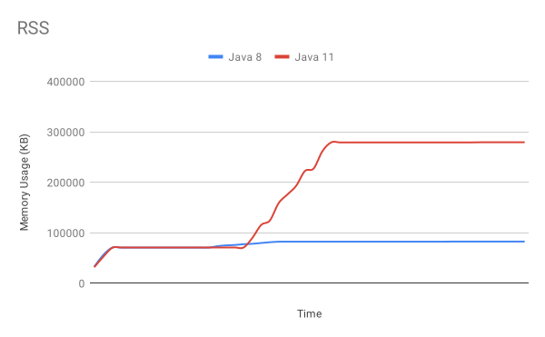

# Problem 2: Diagnosing A Memory Usage Discrepancy

I'm tasked with analyzing the memory usage difference when this application is
compiled with Java 8 `native-image` and Java 11 `native-image`.

I don't have any prior experience diagnosing memory usage issues on
`native-image`-compiled applications, and I have very little experience
diagnosing memory usage issues in other contexts. So, for me this is all quite
new.

I spent almost all of my time this week working on Problem 1 of this homework.
I only budgeted myself part of a day to work on this problem.

However, my under-informed understanding of the problem right now is this: in
the Java 11 case, the OS is not paging-out virtual memory from physical memory
as readily as in the Java 8 case. Unfortunately, I don't have enough
understanding of the OS's virtual memory management to speculate on why this
might be the case.

## Initial Research Questions

I started working on this problem by working on two different questions:

1. What tools are available to me to help me inspect and profile memory usage of
a `native-image` generated Java application?
2. How does the `webflux-netty` sample integration test already meaure memory
usage?

## Question 1: What Tooling Is Available?

When researching (1), I found that GraalVM Enterprise Edition can support
VisualVM-based memory monitoring and heap dumps, but GraalVM Community Edition
cannot. Because I don't have access to the EE, that limits my options to inspect
a live SVM-based Java heap.

I also found some GraalVM `native-image` [memory management
documentation][graalvm-memory-management] with some context and some possibly
useful memory configuration options. However, nothing seemed immediately useful
to me.

I didn't find any `native-image`-specific memory inspection tools which I can
use. It looks like I will need to stick with tools meant for native code. This
will likely be complicated by the complexity of the SVM's memory management.

Fortunately, I had more success pursuing my second research question.

## Question 2: How Is Memory Usage Measured During the Integration Test?

I set up SDKMAN! on my development system to enable easy switching between
GraalVM v21.2.0's Java 8 and Java 11 releases.

When the `samples/webflux-netty/build.sh` script completes, it prints out a
few statistics.

With the Java 8 JDK enabled, I got statistics such as this:

```
Build memory: 6.51GB
Image build time: 91.1s
RSS memory: 73.6M
Image size: 59.6M
Startup time: 0.04 (JVM running for 0.041)
```

With the Java 11 JDK enable, I got statistics such as this:

```
Build memory: 7.03GB
Image build time: 103.9s
RSS memory: 121.8M
Image size: 61.6M
Startup time: 0.038 (JVM running for 0.039)
```

Notice that RSS memory usage is much higher in the latter case. Though the Java
11 RSS value varied, it was consistently much higher. Why is this?  What does
RSS mean? How does the integration test measure this value?

By skimming the source code of the relevant scripts, I found that
`scripts/test.sh`

1. Starts the `native-image`-compiled `webflux-netty` server.
2. Sleeps for three seconds.
3. Runs `samples/webflux-netty/verify.sh`, which uses `curl` to create three
HTTP requests to this server to distinct endpoints: `/`, `/x`, and `/hello`.
4. Uses `ps -o rss` to get the memory usage of the server.

The `rss` used here refers to "resident set size". This is a new term to me.

So, now I know where this information is coming from. But what does it mean?
What memory usage problem does it illuminate?

## Collecting More Memory Usage Data

I noticed from the `man ps` that RSS is just one available measure of memory
usage of a Linux process. What do these different measurements mean?

I am also suspicious that there is only one memory usage measurement taken
during the test. What if the memory usage of Java 8 and Java 11 are similar,
just at slightly different times.

I was curious about the behavior of the server across two dimensions:

1. Across time as more HTTP requests were handled
2. Across these different measurement strategies

I wanted some more data describing the behavior of the server across these two
dimensions. So I wrote a [test script][test-script] to help collect such data.
This test script:

- starts the server
- starts periodic client requests in the background
- periodically uses the `ps` command to collect three memory usage measurements:
RSS, SIZE, and VSIZE.

RSS, SIZE, and VSIZE are defined in the `ps` man page like this:

- RSS: resident set size, the non-swapped physical memory that a task has used.
- SIZE: approximate amount of swap space that would be required if the process
were to dirty all writable pages and then be swapped out.
- VSIZE: virtual memory size of the process.

I created two `webflux-netty` executables. One made with Java 8 `native-image`,
and one made with Java 11 `native-image`. I then ran this script twice, once
with each of these executables.

Testing was performed on my Fedora 34 Linux Development Laptop with Linux kernel
version 5.13.6-200.fc34.x86_64 and 64 GB of memory.

These two test runs generated two CSV files: [`java8-data.csv`][java8-data-csv]
and [`java11-data.csv`][java11-data-csv]. Here are plots of these data:




Notice that the RSS graph shows that RSS usage is very different between Java 8
and Java 11. In the Java 8 case, memory usage stays steady throughout. In the
Java 11 case, memory usage climbs much higher before plateauing.

The SIZE and VSIZE graphs are quite different. They show Java 8 and Java 11 both
climb and plateau similarly. (They differ in *when* they start climbing but this
is likely due to timing imprecision in our test script.)

## Read the Data and Diagnose the Problem

The memory behavior between Java 8 and Java 11 is indeed very different when
measuring RSS. However, I think that it is rather telling that they are actually
quite similar when measuring with either SIZE or VSIZE.

I have a very limited understanding of virtual memory management. But my current
understanding is that RSS is the amount of physical memory actually being
used at one moment, whereas VSIZE is the amount that the process logically
addresses. VSIZE is the sum total of the code segment, the Java heap, metaspace,
and everything else. RSS is a subset of this.

All of this suggests to me that the problem is not a memory leak in the Java
application, per-se. Rather, the problem is that Java 11 is doing something with
its memory pages to make the OS keep the much more of process's memory in
physical memory. I believe that we want to diagnose why paging isn't happening.
However, I don't currently know very much about how the OS makes paging
decisions. So, I would need to research these issues more before I can
speculate and further diagnose the issue.

## VisualVM Support from GraalVM Enterprise Edition Probably Won't Help

My previous familiarity with diagnosing Java application memory usage is limited
to using VisualVM to monitor memory usage and to create heap dumps. I believe
that such analysis may not be relevant here. Note that using VisualVM or similar
would not be measuring the right thing: memory paging behavior. VisualVM
measures Heap size and Metaspace size. It doesn't distinguish between whether
memory is physically resident or not.

## Other Questions

I am curious about how this application behaves when it is run with the JVM.
Will the JVM's RSS behave more similarly to Java 8 or Java 11?

Does this problem also arise on different operating systems like macOS and
Windows? What about different Linux kernel versions or configurations?

Memory usage data was collected while there was no global OS memory pressure
(i.e., physical usage was nowhere close to the physical limit). Maybe with
greater memory pressure, unneeded pages will be swapped out by the OS
no-problem. Will RSS be more aggressively paged out of the Java 11 process if
the OS is running low on physical memory?

Here, we have only collected rather narrow data. We record memory usage as the
total number of sequential requests increases at an even rate. What about
concurrent requests? What about variations in concurrent load?

I believe that for this application we are not so much concerned with the memory
usage of our application at any one time. Rather, we are concerned with the
performance properties of the application as it recieves requests. Can the
server keep up? Does it remain responsive under load? Does the server remain
responsive when it reaches its memory usage plateau?

It is my understanding that in both the Java 8 and Java 11 cases, the same
garbage collector is being used: `serial`. However, is there a relevant
difference related to garbage collection? Could the garbage collector be keeping
some memory from being paged out?

---

[graalvm-memory-management]: https://www.graalvm.org/reference-manual/native-image/MemoryManagement/
[test-script]: https://github.com/dwtj/dwtj_vmware_homework_docs/blob/aa27ece4668322e12d964a18d37e69c7d3667e35/scripts/collect_memory_data.sh
[java8-data-csv]: https://github.com/dwtj/dwtj_vmware_homework_docs/blob/aa27ece4668322e12d964a18d37e69c7d3667e35/data/java8-data.csv
[java11-data-csv]: https://github.com/dwtj/dwtj_vmware_homework_docs/blob/aa27ece4668322e12d964a18d37e69c7d3667e35/data/java11-data.csv
